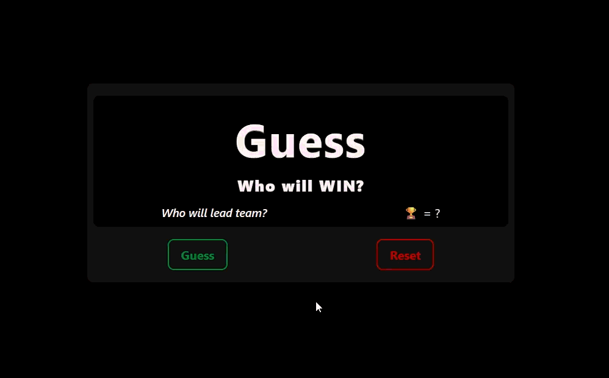

# 🏏 IPL 2026 Winner Guessing Game — Interactive UI

A fun and interactive **IPL 2026 winner guessing game** built using **HTML**, **SCSS**, and **JavaScript**.  
This project randomly predicts an IPL team as the winner and dynamically updates the UI with **team colors, captain name, and trophy count**.

The focus is on **array-driven logic**, **random selection**, **DOM manipulation**, and **dynamic theme switching** for an engaging user experience.

---

## ✨ Features

- 🏏 **Random IPL team prediction**
- 🎲 **One-click guess functionality**
- 🔄 **Reset to initial state**
- 🎨 **Dynamic UI color changes per team**
- 🧠 **Array-based data handling**
- 🏆 **Displays captain & trophy count**
- 🧩 **Pure HTML, SCSS & JavaScript**
- ⚡ Lightweight and responsive UI

---

## 🌐 Live Demo / Review

You can view and interact with the project here:  
👉 [IPL 2026 Winner Guessing Game - Live Demo](https://harsh-codes-hub.github.io/IPL-2026-Winner-Guessing-Game-TASK19/)

Click **Guess** to predict a team and **Reset** to start over.

---

## 🗂️ File Structure

```bash
IPL-2026-Winner-Guessing-Game-TASK19/
│
├── index.html        # Main HTML structure
├── style.css         # Compiled CSS from SCSS
├── style.scss        # SCSS source file
├── script.js         # JavaScript game logic
├── preview.gif       # Preview animation
│
├── /favicon          # Website icons & manifest
│   ├── android-chrome-192x192.png
│   ├── android-chrome-512x512.png
│   ├── apple-touch-icon.png
│   ├── favicon-16x16.png
│   ├── favicon-32x32.png
│   ├── favicon.ico
│   └── site.webmanifest
│
└── README.md         # Project documentation

```

---

## 💻 Usage

1. **Clone the repository:**
   ```bash
   git clone https://github.com/Harsh-Codes-hub/IPL-2026-Winner-Guessing-Game-TASK19.git
   ```
2. **Navigate to the project directory:**
   ```bash
   cd IPL-2026-Winner-Guessing-Game-TASK19
   ```
3. _Open the project in your browser_
   ```
   open index.html
   ```
   or simply double-click on **index.html**

---

## 🧠 Learning Highlights

- 🏏 Worked with **arrays of objects** for structured data
- 🎲 Implemented **random selection logic**
- 🎨 Practiced **dynamic inline styling with JS**
- 🧠 Strengthened **DOM manipulation skills**
- 🔄 Managed **UI reset and state control**
- ⚡ Built a complete interactive mini-game experience

---

## 🧠 What Makes This Project Special

- 🏏 Fun **sports-based guessing concept**
- 🎨 Dynamic **team-based** color theming
- 🧠 Clean separation of data and UI logic
- ⚡ Lightweight, fast, and framework-free
- 🧩 Beginner-friendly but scalable logic
- 🎯 Great practice for interactive JS projects

---

## 📸 Preview

_IPL team guessing game with dynamic colors and team details._



---

## 🛠️ Built With

- 🧾 **HTML5**
- 🎨 **CSS3 / SCSS**
- 🧩 **JavaScript (DOM & Logic)**
- 🎯 **Interactive UI Design**
- 📱 **Responsive Layout**

---

## 👨‍💻 Author

**Cohort 2.0 – Batch Task 19 Submission**  
Created by **Harsh Gajrani** _(Harsh Codes Hub)_  
Part of the **Cohort 2.0 batch at Sheryians Coding School**

Part of frontend interaction and logic practice
Focused on **arrays, randomization, and dynamic UI updates**

---

_⭐ If you enjoy interactive mini-games or learning JavaScript fundamentals, feel free to star the repository!_

---
